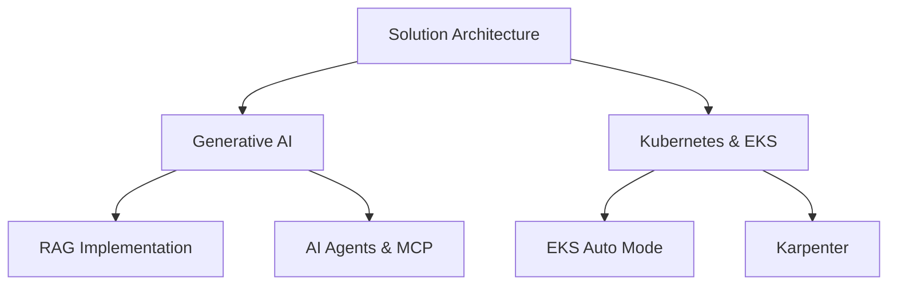

# Hi there, I'm Harry Siddhu! 👋

<div align="center">
  
</div>

<div align="center">
  
  
</div>

## 🚀 About Me

```yaml
name: Harry Siddhu
role: AWS Hands-On Solution Architect
location: Global
current_focus: 
  - Solution Architecture
  - Generative AI & Agentic AI
  - RAG Implementation
  - AI Agents & MCP
  - Kubernetes & EKS
  - EKS Auto Mode & Karpenter
```

## 🏆 Certifications & Recognition

<div align="center">
  
  
  
  
</div>

## 💼 Expertise

### ☁️ Cloud Migration & Modernization
- **AWS Migration Hub** | **Application Migration Service** | **Database Migration Service**
- **Legacy Application Modernization** | **Microservices Architecture**

### ⚡ Serverless Technologies
- **AWS Lambda** | **API Gateway** | **SNS/SQS** | **Event-Driven Architecture**

### 🐳 Containerization & Orchestration
- **Amazon ECS/Fargate** | **Kubernetes** | **Amazon EKS** | **Karpenter**

### 🤖 AI & Machine Learning
- **Generative AI Solutions** | **RAG Implementation** | **AI Agents** | **MCP (Model Context Protocol)**

## 🛠️ Tech Stack

<div align="center">
  
</div>

### Languages & Frameworks


### Cloud & DevOps


## 📊 GitHub Analytics

<div align="center">
  
  
</div>

<div align="center">
  
</div>

## 🎯 Featured Projects

<div align="center">
  <a href="https://github.com/hsiddhu2/ECS-Fargate-App-Deployment">
    
  </a>
  <a href="https://github.com/hsiddhu2/Serverless-Email-Marketing-Application">
    
  </a>
</div>

<div align="center">
  <a href="https://github.com/hsiddhu2/Serverless-Insurance-Quote-System">
    
  </a>
  <a href="https://github.com/hsiddhu2/s3-object-lambda">
    
  </a>
</div>

## 📈 Contribution Graph

<div align="center">
  
</div>

## 🌐 Connect With Me

<div align="center">
  <a href="https://www.linkedin.com/in/harpreetsiddhu/">
    
  </a>
  <a href="http://medium.com/@harrysiddhu">
    
  </a>
  <a href="https://www.youtube.com/@CloudWithHarry">
    
  </a>
</div>

## 💡 Current Focus



## 🎨 Fun Fact

<div align="center">
  
</div>

---

<div align="center">
  
</div>

<div align="center">
  <i>⭐️ From <a href="https://github.com/hsiddhu2">hsiddhu2</a> - Building the future, one cloud solution at a time! ☁️</i>
</div>