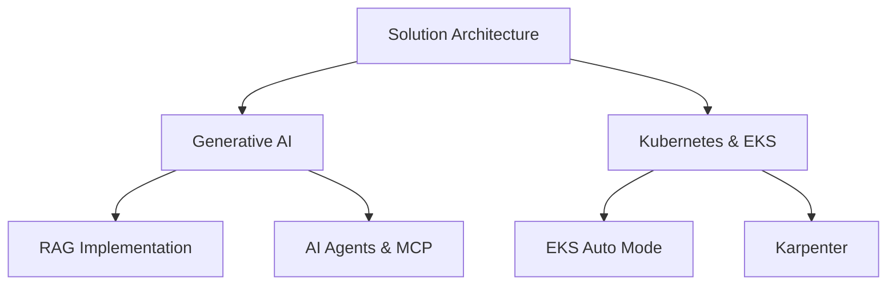

# Hi there, I'm Harry Siddhu! 👋

<div align="center">
  
</div>

<div align="center">
  
  
</div>

## 🚀 About Me

Hi, I'm **Harry Siddhu**, a hands-on AWS Solution Architect with **18+ years** of experience in solutions architecture, system design, software development, implementation etc. My superpower is continuous learning and exploring new technologies. I thrive on solving complex problems and delivering innovative solutions that drive business success.

### 🎯 My Journey
Starting as a Backend Development Engineer with **Java & Spring Boot**, I transitioned into cloud technologies where I specialize in building and refactoring IT systems to unlock their full potential in the cloud.

### 💡 What I Do
- **Cloud Architecture Design**: Crafting scalable, secure, and cost-effective solutions tailored to business needs
- **Cloud Migrations**: Transforming monolithic applications into microservices and lift-and-shift migrations
- **Infrastructure Automation**: Utilizing CloudFormation and DevOps practices for consistent deployments
- **Cost Optimization**: Analyzing and optimizing cloud resources while maintaining performance
- **Technical Leadership**: Conducting training and fostering continuous learning culture

```yaml
name: Harry Siddhu
role: AWS Hands-On Solution Architect
experience: 18+ years
location: Global
current_focus: 
  - Solution Architecture
  - Generative AI & Agentic AI
  - RAG Implementation
  - AI Agents & MCP
  - Kubernetes & EKS
  - EKS Auto Mode & Karpenter
```

## 🏆 Certifications & Recognition

<div align="center">
  
  
  
  
</div>

## 🎯 Core Competencies

<div align="center">
  
  
  
  
  
</div>

## 💼 Core Expertise

### ☁️ Cloud Architecture & Migration
- **AWS Services**: EC2, S3, VPC, RDS, DynamoDB, IAM, Route 53, CloudFormation, CloudFront, CloudWatch
- **Migration Strategies**: Lift-and-shift, Application modernization, Monolith to microservices
- **AWS Migration Hub** | **Application Migration Service** | **Database Migration Service**

### 🔧 Infrastructure & Automation
- **Infrastructure as Code**: CloudFormation, Terraform
- **DevOps Practices**: CI/CD pipelines, automated deployments
- **Monitoring & Optimization**: Cost management, performance tuning

### 🐳 Containerization & Orchestration
- **Docker**: Container management and deployment
- **Kubernetes**: Container orchestration platform
- **Amazon ECS/Fargate** | **Amazon EKS** | **Karpenter**

### ⚡ Serverless & Event-Driven Architecture
- **AWS Lambda** | **API Gateway** | **SNS/SQS** | **Event-Driven Architecture**
- **Serverless Application Design** | **Cost-Effective Solutions**

### 🤖 AI & Machine Learning
- **Generative AI Solutions** | **RAG Implementation** | **AI Agents** | **MCP (Model Context Protocol)**
- **AWS AI/ML Services Integration**

## 🛠️ Tech Stack

<div align="center">
  
</div>

### Languages & Frameworks


### Cloud & DevOps


## 📊 GitHub Analytics

<div align="center">
  
  
</div>

<div align="center">
  
</div>

## 🎯 Featured Projects

<div align="center">
  <a href="https://github.com/hsiddhu2/ECS-Fargate-App-Deployment">
    
  </a>
  <a href="https://github.com/hsiddhu2/Serverless-Email-Marketing-Application">
    
  </a>
</div>

<div align="center">
  <a href="https://github.com/hsiddhu2/Serverless-Insurance-Quote-System">
    
  </a>
  <a href="https://github.com/hsiddhu2/s3-object-lambda">
    
  </a>
</div>

## 📈 Contribution Graph

<div align="center">
  
</div>

## 📝 Latest Blog Posts

<!-- BLOG-POST-LIST:START -->- [15 Strategies To Optimize Amazon EC2 Costs Without Compromising Performance](https://aws.plainenglish.io/15-strategies-to-optimize-amazon-ec2-costs-without-compromising-performance-4a8f71340d33?source=rss-96fcaaa6e15------2)- [Serverless Insurance Quote System with AWS — A Complete Tutorial](https://towardsaws.com/serverless-insurance-quote-system-with-aws-a-complete-tutorial-d3e6c8e54863?source=rss-96fcaaa6e15------2)- [Real-Time Data Transformation with Amazon S3 Object Lambda](https://towardsaws.com/real-time-data-transformation-with-amazon-s3-object-lambda-f9451c6a4c8a?source=rss-96fcaaa6e15------2)- [Deploy SpringBoot Java App on EC2 with CICD Automation ✌️](https://aws.plainenglish.io/deploy-springboot-java-app-on-ec2-with-cicd-automation-%EF%B8%8F-2915eb737db7?source=rss-96fcaaa6e15------2)- [Build A Serverless Email Marketing Applications Using AWS](https://aws.plainenglish.io/build-a-serverless-email-marketing-applications-using-aws-252143efb5cf?source=rss-96fcaaa6e15------2)<!-- BLOG-POST-LIST:END -->

## 🎥 Latest YouTube Videos

<!-- YOUTUBE:START -->- [Unlocking AI Potential with AWS Bedrock: Customizable, Scalable, and Cost-Effective #bedrock #ai](https://www.youtube.com/shorts/msVbahV6AC8)- [The Fastest Way to Learn DevOps in 2025 #DevOps #CloudComputing #Containers  #Kubernetes #Terraform](https://www.youtube.com/shorts/3TvJNiF9m5Q)- [Top 5 DevOps Skills in High Demand in 2025 #devops  #Kubernetes #Containerization #CICD #DevSecOps](https://www.youtube.com/shorts/CvRAKWar-0w)- [Amazon Bedrock API Tutorial: Build Generative AI Apps Fast](https://www.youtube.com/watch?v=egUeMRMw1G8)- [7 Strategies for Optimizing Cloud Costs #CloudCostOptimization #CloudComputing #CostSavingTips](https://www.youtube.com/shorts/Os7jliyaKas)<!-- YOUTUBE:END -->

## 🗺️ Visitor Map

<div align="center">
  
</div>

<div align="center">
  
</div>

## 🌐 Connect With Me

<div align="center">
  <a href="https://www.linkedin.com/in/harpreetsiddhu/">
    
  </a>
  <a href="http://medium.com/@harrysiddhu">
    
  </a>
  <a href="https://www.youtube.com/@CloudWithHarry">
    
  </a>
</div>

<div align="center">
  
</div>

## 💡 Current Focus



## 🎨 Fun Fact

<div align="center">
  
</div>

---

<div align="center">
  
</div>

<div align="center">
  <i>⭐️ From <a href="https://github.com/hsiddhu2">hsiddhu2</a> - Building the future, one cloud solution at a time! ☁️</i>
</div>